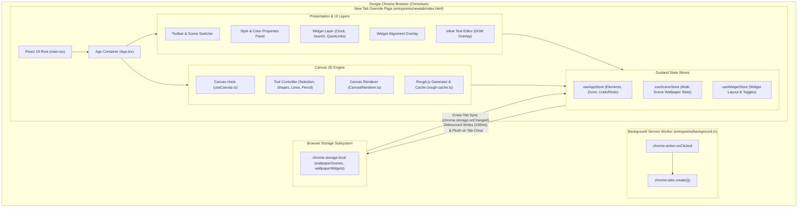
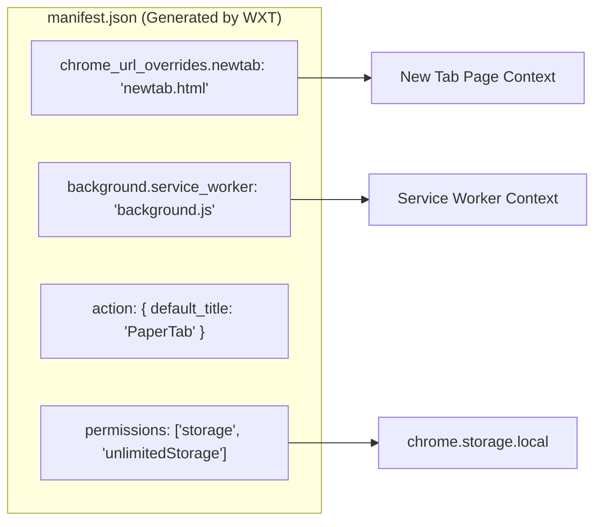
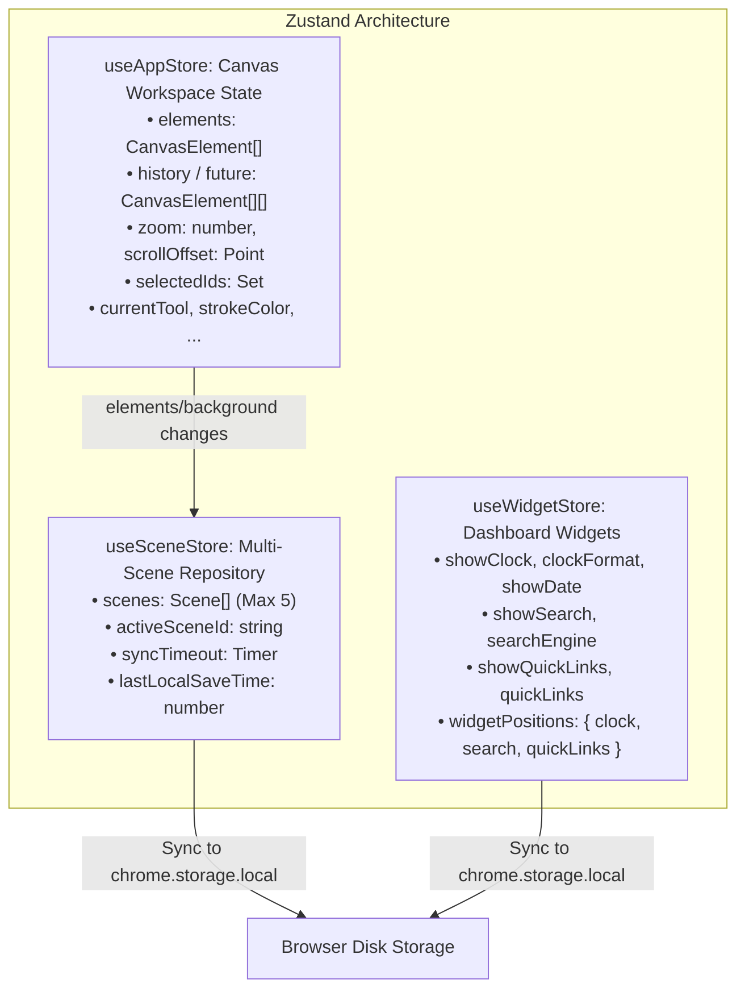
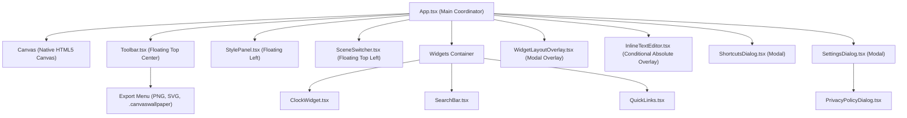
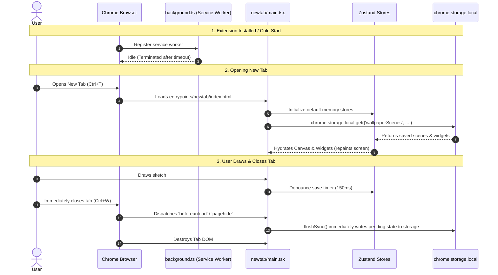
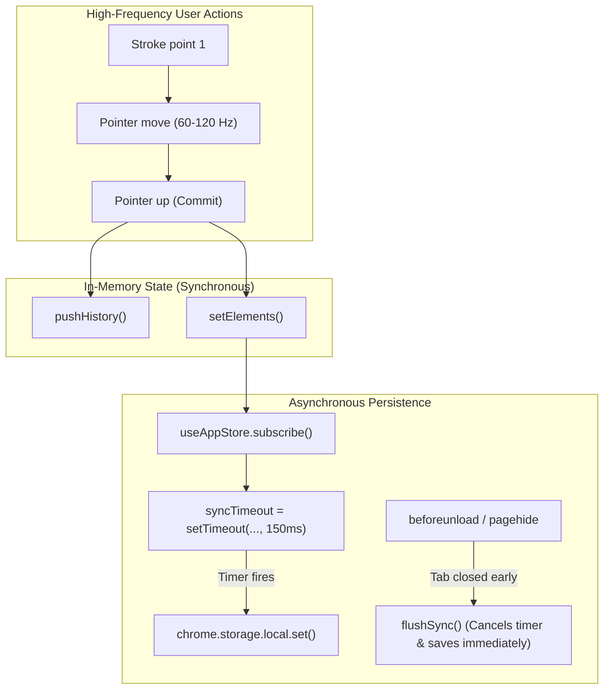

# PaperTab: Technical Architecture & System Design Documentation

---

## 1. The Big Picture

### What This Application Does
**PaperTab** is a local-first, privacy-focused Chrome Extension (Manifest V3) that replaces the browser's default New Tab page with an interactive, drawable canvas wallpaper. 

It provides a dual-mode experience:
1. **Wallpaper Mode (Clean/Ambient)**: Serves as a desktop dashboard featuring customizable, freely repositionable widgets (Digital Clock, Date, Search Bar with multi-engine support, and Quick Links with automatic favicon resolution). The background canvas displays the user's artwork without any editing UI or canvas controls.
2. **Drawing Mode (Interactive Canvas)**: Turns the New Tab into a full-featured vector sketchpad inspired by Excalidraw. Users can draw shapes (rectangles, diamonds, ellipses, lines, arrows, freehand pencil), insert styled text, paste or upload images, group/lock elements, adjust layering, and pan/zoom infinitely.

### What Problem It Solves
Most new tab extensions are either passive image carousels or rigid productivity dashboards. PaperTab merges personal artistic expression, whiteboard ideation, and functional productivity into a single zero-latency surface. Everything is stored locally with zero tracking and zero external server dependencies.

### Target Users
- Developers, designers, students, and visual thinkers who want a scratchpad or visual dashboard on every new browser tab.
- Users who want full privacy and offline reliability without logins, telemetries, or cloud dependencies.

### High-Level System Architecture Diagram



---

## 2. Technology Stack & Role Inside This Project

| Technology / Library | Version | Role Inside PaperTab | Why This Project Uses It |
| :--- | :--- | :--- | :--- |
| **WXT (Web Extension Tools)** | `^0.21.4` | Build tool, CLI, and framework for Chrome Extension MV3. | Generates standard MV3 output, compiles `chrome_url_overrides.newtab`, manages entrypoint bundling, and provides fast Vite development. |
| **React** | `^19.3.0` | Declarative UI framework. | Manages UI components (dialogs, toolbar, style panel, widgets) while allowing the high-frequency Canvas 2D engine to operate independently. |
| **Zustand** | `^5.0.15` | Global reactive state management. | Provides lightweight, hook-based stores outside the React component tree (`useAppStore`, `useSceneStore`, `useWidgetStore`) with sub-millisecond updates and selector-based subscriptions. |
| **Rough.js** | `^4.6.6` | Hand-drawn 2D vector graphics generator. | Transforms geometric primitives (rectangles, diamonds, ellipses, lines) into sketchy, organic, hand-drawn vector art. |
| **Tailwind CSS** | `^4.3.3` | Utility-first styling engine. | Generates zero-runtime CSS with modern OKLCH/P3 colors, glassmorphism (`backdrop-blur`), and responsive positioning. |
| **Lucide React** | `^1.47.0` | UI vector iconography. | Provides crisp icons for tools, alignment, widgets, and modal dialogues. |
| **clsx & tailwind-merge** | `^2.1.1` / `^3.7.0` | Dynamic class string merging. | Safely constructs conditional Tailwind classes without specificity collisions. |
| **Chrome Storage API** | `MV3` | Local persistent storage. | Provides `chrome.storage.local` with `unlimitedStorage` permission to persist scene data, canvas elements, and widget coordinates. |

---

## 3. Repository Structure

```text
canvas-wallpaper/
├── .output/                     # Built extension artifact directory (ignored by git)
│   └── chrome-mv3/              # Unpacked Chrome extension ready to load into Chrome
├── entrypoints/                 # WXT Entrypoint definitions
│   ├── background.ts            # Extension background service worker
│   └── newtab/                  # New Tab override entrypoint
│       ├── index.html           # Root HTML template preloading fonts and defining #root
│       └── main.tsx             # React bootstrap script mounting App.tsx
├── public/                      # Static assets copied directly to build output
│   ├── fonts/                   # Hand-drawn woff2 font files (Excalifont, Virgil)
│   └── icon/                    # Extension action icons (16, 32, 48, 128 px)
├── src/                         # Core application source code
│   ├── canvas/                  # Native HTML5 Canvas 2D engine
│   │   ├── CanvasRenderer.ts    # Coordinate space transforms, drawing passes, selection outlines
│   │   ├── geometry.ts          # Pure math (bounding boxes, ray casting, rotation matrices)
│   │   ├── rough-cache.ts       # Bounded LRU cache for Rough.js Drawable objects
│   │   └── useCanvas.ts         # React pointer and wheel lifecycle controller
│   ├── components/              # React UI overlays and modal dialogs
│   │   ├── InlineTextEditor.tsx # In-place rotated textarea overlay for text editing
│   │   ├── PrivacyPolicyDialog.tsx # Local privacy policy modal
│   │   ├── SceneSwitcher.tsx    # Scene manager popover (switch, add, rename, delete)
│   │   ├── ShortcutsDialog.tsx  # Keyboard shortcuts cheatsheet modal
│   │   ├── StylePanel.tsx       # Color palettes, stroke width, opacity, roughness controls
│   │   └── Toolbar.tsx          # Floating top toolbar (tools, undo/redo, zoom, export)
│   ├── elements/                # Element definitions and factory helpers
│   │   ├── factory.ts           # createElement() builder for standard element types
│   │   └── types.ts             # TypeScript interfaces for CanvasElement, Tools, Styles
│   ├── hooks/                   # Business logic and export hooks
│   │   ├── useExport.ts         # Offscreen Canvas PNG rasterizer and file downloader
│   │   ├── useSvgExport.ts      # Vector SVG serializer with XML sanitization
│   │   └── useWallpaperFile.ts  # JSON .canvaswallpaper schema import/export
│   ├── lib/                     # Utilities and default presets
│   │   ├── defaultWallpaperPreset.ts # Default decorative artwork sketch for Scene 1
│   │   ├── groups.ts            # Transitive group-selection graph algorithms
│   │   ├── imageInsert.ts       # Image upload, file parsing, and resolution downscaling
│   │   └── utils.ts             # cn(), newId(), randomSeed(), URL sanitization, XML escaping
│   ├── store/                   # State management layer
│   │   ├── useAppStore.ts       # Canvas active elements, drafts, undo/redo, camera zoom/pan
│   │   ├── useSceneStore.ts     # Multi-scene state, active scene switching, disk sync
│   │   └── useWidgetStore.ts    # Widget positioning, toggles, quicklinks
│   ├── styles/
│   │   └── globals.css          # Tailwind CSS root imports and font face definitions
│   ├── widgets/                 # Floating New Tab desktop widgets
│   │   ├── ClockWidget.tsx      # Configurable 12h/24h digital clock and localized date
│   │   ├── QuickLinks.tsx       # Speed dial cards with Google S2 favicon resolution
│   │   ├── SearchBar.tsx        # Multi-engine search redirect (Google, DDG, Bing, Brave)
│   │   ├── SettingsDialog.tsx   # Widget configuration modal
│   │   └── WidgetLayoutOverlay.tsx # Visual grid overlay for freeform drag-and-drop alignment
│   ├── App.tsx                  # Top-level coordinator: keyboard manager, clipboard, mode switch
│   └── vite-env.d.ts            # Vite client type definitions
├── package.json                 # Project dependencies, scripts, metadata
├── tsconfig.json                # TypeScript compiler configuration (strict mode)
└── wxt.config.ts                # WXT configuration defining manifest permissions & metadata
```

---

## 4. Chrome Extension Manifest V3 Architecture

PaperTab is built strictly within the boundaries of **Chrome Extension Manifest V3**.



### Manifest Fields Breakdown
- **`manifest_version: 3`**: Adheres to modern extension security rules (no remote code execution, declarative background workers).
- **`chrome_url_overrides.newtab: "newtab.html"`**: The core declaration that causes Google Chrome to open `entrypoints/newtab/index.html` whenever the user presses `Ctrl+T` or clicks the "+" button for a new tab.
- **`permissions: ["storage", "unlimitedStorage"]`**:
  - `storage`: Grants access to `chrome.storage.local` and `chrome.storage.onChanged`.
  - `unlimitedStorage`: Removes the standard 5MB/10MB quota ceiling on `chrome.storage.local`, allowing multiple scenes containing vector strokes and compressed base64 images without quota exceptions.
- **`action: { default_title: "PaperTab", default_icon: ... }`**: Registers an extension icon in the Chrome toolbar.
- **`background.service_worker: "background.js"`**: Registers the ephemeral service worker.

---

## 5. Runtime Environments & Contexts

PaperTab operates in **two** runtime contexts. It deliberately does **not** inject content scripts into user web pages.

### Context 1: The New Tab Page (`entrypoints/newtab/`)
* **Type**: Privileged Extension DOM Page (`chrome-extension://<id>/newtab.html`).
* **Lifecycle**: Created when a new tab is opened; destroyed when that tab is closed or navigated away from.
* **Capabilities**: Has full access to DOM, HTML5 Canvas 2D API, Web Workers, CSS, and extension APIs (`chrome.storage`, `chrome.tabs`).
* **State Ownership**: Owns the in-memory React component tree, the active Zustand store instances (`useAppStore`, `useSceneStore`, `useWidgetStore`), the HTML5 `<canvas>` rendering pipeline, and the active undo/redo history.
* **Teardown**: On tab closure, `window.addEventListener('beforeunload')` and `window.addEventListener('pagehide')` fire to flush any pending debounced writes to disk.

### Context 2: The Background Service Worker (`entrypoints/background.ts`)
* **Type**: Event-driven background worker.
* **Lifecycle**: Idle by default; Chrome spins it up on demand and terminates it after ~30 seconds of inactivity.
* **Functionality**: Minimal and stateless. Contains a single listener:
  ```ts
  chrome.action.onClicked.addListener(() => {
    chrome.tabs.create({});
  });
  ```
  When the user clicks the PaperTab icon in the Chrome browser toolbar, it simply commands Chrome to open a new tab.

---

## 6. Complete Data & Control Flows

### 1. Drawing a New Shape Flow
```text
User presses mouse down on Canvas
  ↓
useCanvas.ts onPointerDown() captures pointerId
  ↓
ShapeTool.onPointerDown() creates draft CanvasElement via factory.ts
  ↓
useAppStore.setDraft(draft)
  ↓
CanvasRenderer.render() draws current scene elements + active draft
  ↓
User moves pointer: ShapeTool.onPointerMove() updates draft coordinates
  ↓
User releases pointer: ShapeTool.onPointerUp()
  ↓
useAppStore.pushHistory() (saves snapshot of previous elements array)
  ↓
useAppStore.setElements([...elements, finalizedShape])
  ↓
useAppStore.setSelectedIds([finalizedShape.id])
  ↓
useAppStore.setTool('selection')
  ↓
useAppStore.subscribe() triggers in useSceneStore.ts
  ↓
useSceneStore maps updated elements into active scene in scenes array
  ↓
Debounce timer (150ms) starts
  ↓
Timer fires: useSceneStore.saveScenesToStorage()
  ↓
lastLocalSaveTime = Date.now() recorded
  ↓
chrome.storage.local.set({ wallpaperScenes, wallpaperActiveSceneId })
```

### 2. Multi-Tab Synchronization Flow
```text
Tab A saves changes to chrome.storage.local
  ↓
Chrome OS/Browser dispatches chrome.storage.onChanged to ALL extension pages
  ↓
Tab A (Originator) receives onChanged:
  ↳ Checks Date.now() - lastLocalSaveTime < 350ms
  ↳ True -> Drops event immediately (prevents history wiping & self-echo)
  ↓
Tab B (Passive open tab) receives onChanged:
  ↳ Checks Date.now() - lastLocalSaveTime < 350ms
  ↳ False -> Calls useSceneStore.loadScenesFromStorage()
  ↳ Checks if activeSceneId changed:
       - If changed: useAppStore.resetHistory() (prevents cross-scene undo bleed)
       - If same: preserves Tab B's in-memory undo/redo history
  ↳ Validates selectedIds against incoming elements (preserves valid selection)
  ↳ Updates useAppStore with incoming elements
  ↳ Triggers CanvasRenderer.render() in Tab B
  ↳ Tab B's screen mirrors Tab A seamlessly
```

### 3. In-Place Text Editing Flow
```text
User double clicks on canvas or clicks with TextTool
  ↓
TextTool.ts openTextEditor() calculates canvas coordinates
  ↓
useAppStore.setEditingText({ canvasX, canvasY, fontSize, fontFamily, ... })
  ↓
CanvasRenderer.drawElement() skips rendering the element currently in editingText
  ↓
React renders InlineTextEditor.tsx textarea positioned at screen center with:
  left: (canvasX - scroll.x) * zoom + editorWidth / 2
  top: (canvasY - scroll.y) * zoom + editorHeight / 2
  transform: translate(-50%, -50%) rotate(angle)
  transformOrigin: center center
  ↓
User types text (DOM textarea auto-expands dynamically)
  ↓
User hits Escape or clicks outside (handleBlur)
  ↓
InlineTextEditor.tsx commit()
  ↓
App.tsx handleCommitText():
  ↳ useAppStore.pushHistory()
  ↳ Updates existing TextElement or creates new TextElement via newId()
  ↳ useAppStore.setEditingText(null)
  ↳ useAppStore.saveToStorage()
```

---

## 7. Core Business Logic & Algorithms

### 1. Rough.js Bounded LRU Cache (`src/canvas/rough-cache.ts`)
Rough.js generates sketchy vector paths using randomized seeds. If paths were re-generated on every frame, lines would jitter randomly ("boiling effect") and destroy 60 FPS performance.
* **Mechanism**: `getRoughDrawable(el)` computes a deterministic composite cache key:
  `[type, x, y, width, height, strokeColor, fillColor, fillStyle, strokeWidth, strokeStyle, roughness, seed].join(',')`
* **Oldest-Entry Eviction**: Bounded to 500 entries. When `cache.size >= 500`, `cache.keys().next().value` deletes the oldest inserted key before setting the new key.

### 2. Geometry, Coordinate Systems & Rotations (`src/canvas/geometry.ts`)
* **Camera Transform Matrix**:
  To render elements with camera Pan and Zoom:
  $$\text{ScreenX} = (\text{CanvasX} - \text{ScrollOffset.x}) \times \text{Zoom}$$
  $$\text{CanvasX} = \frac{\text{ScreenX}}{\text{Zoom}} + \text{ScrollOffset.x}$$
* **Arbitrary Angle Rotation**:
  To rotate any point $(x, y)$ around a center point $(cx, cy)$ by angle $\theta$:
  $$x' = cx + (x - cx) \cos\theta - (y - cy) \sin\theta$$
  $$y' = cy + (x - cx) \sin\theta + (y - cy) \cos\theta$$
* **Ray Casting & Hit Testing**:
  Selection tests hit points by first transforming the click point into the element's local unrotated coordinate space:
  $$\text{localPos} = \text{rotatePoint}(\text{clickPos}, \text{center}, -\theta)$$
  It then tests whether `localPos` falls within the normalized axis-aligned bounding box or polyline buffer.

### 3. Image Optimization & Resolution Clamping (`src/lib/imageInsert.ts`)
When large images (e.g. 4K/8K photos) are uploaded or pasted:
* If `Math.max(img.width, img.height) <= 1600`: keeps original data.
* If $> 1600$: scales image down proportionally onto an offscreen HTML5 canvas:
  $$\text{scale} = \min\left(\frac{1600}{\text{width}}, \frac{1600}{\text{height}}\right)$$
* Encodes as `canvas.toDataURL('image/png')`. This prevents multi-megabyte string serialization from locking the browser thread during disk writes.

### 4. Transitive Group Selection Graph (`src/lib/groups.ts`)
Elements support nested and multiple grouping tags in `el.groupIds: string[]`.
* When element $A$ is clicked, `getConnectedGroupElementIds()` performs a transitive closure:
  1. Finds all group IDs on $A$.
  2. Finds all elements in the scene sharing any of those group IDs.
  3. Recursively gathers group IDs from those newly matched elements until the set converges.
  4. Selects all matched elements as a single rigid body.

### 5. Magnetic Widget Alignment Snapping (`src/widgets/WidgetLayoutOverlay.tsx`)
When the user drags a widget in layout mode:
* Positions are measured in percentages of viewport width and height (`0%` to `100%`).
* **Center Snap**: If within $\pm 2.5\%$ of the $50\%$ screen centerline, it snaps to `50%`.
* **Quarter Snaps**: If within $\pm 2.0\%$ of $25\%$ or $75\%$, it snaps to that axis.
* **Screen Clamp**: Clamps coordinate between $8\%$ and $92\%$ to ensure widgets never clip offscreen.

---

## 8. State Management Architecture

PaperTab manages all state using **three dedicated Zustand stores**.



### Store 1: `useAppStore` (`src/store/useAppStore.ts`)
* **State**: Active canvas element list, draft element in progress, undo stack (`history`, max 50), redo stack (`future`), camera `zoom` ($0.1$ to $5.0$), camera `scrollOffset`, active `selectedIds: Set<string>`, clipboard elements, current drawing styles.
* **History Management**:
  - `pushHistory()`: Clones `elements` array via `JSON.parse(JSON.stringify(elements))` and pushes it to `history`.
  - `undo()`: Moves current elements to `future`, pops last snapshot from `history`, clears `selectedIds`.
  - `redo()`: Pops snapshot from `future`, pushes current to `history`.

### Store 2: `useSceneStore` (`src/store/useSceneStore.ts`)
* **State**: Array of up to 5 `Scene` objects (`{ id, name, elements, background, createdAt }`), `activeSceneId`.
* **Synchronization Bridge**: Subscribes to `useAppStore`:
  ```ts
  useAppStore.subscribe((state, prevState) => {
    if (isHydrating) return;
    if (state.elements !== prevState.elements || state.background !== prevState.background) {
      // Map elements into active scene in scenes array
      // Debounce disk save by 150ms
    }
  });
  ```

### Store 3: `useWidgetStore` (`src/store/useWidgetStore.ts`)
* **State**: Widget visibility toggles, clock 12h/24h format, selected search engine (`google`, `duckduckgo`, `bing`, `brave`), list of quicklinks, and normalized coordinates for `{ clock, search, quickLinks }`.

---

## 9. Storage Architecture & Schemas

### Storage Target: `chrome.storage.local`
All persistent data is stored in Chrome's local extension database. If Chrome APIs are unavailable (e.g. previewing in a standard web browser), code falls back to `window.localStorage`.

### Storage Keys & JSON Schemas

#### Key: `wallpaperScenes`
```json
[
  {
    "id": "default",
    "name": "Wallpaper 1",
    "createdAt": 1727345678901,
    "background": {
      "type": "color",
      "color": "#14141a",
      "pattern": "grid"
    },
    "elements": [
      {
        "id": "1727345700000-abc123",
        "type": "rectangle",
        "x": 200,
        "y": 150,
        "width": 300,
        "height": 180,
        "angle": 0.12,
        "strokeColor": "#ffffff",
        "fillColor": "#a5d8ff",
        "fillStyle": "solid",
        "strokeWidth": 2,
        "strokeStyle": "solid",
        "roughness": 1.4,
        "opacity": 100,
        "locked": false,
        "groupIds": [],
        "seed": 987654321
      }
    ]
  }
]
```

#### Key: `wallpaperActiveSceneId`
```json
"default"
```

#### Key: `wallpaperWidgets`
```json
{
  "showClock": true,
  "clockFormat": "12h",
  "showDate": true,
  "showSearch": true,
  "searchEngine": "google",
  "showQuickLinks": true,
  "quickLinks": [
    { "id": "1", "title": "GitHub", "url": "https://github.com" },
    { "id": "2", "title": "YouTube", "url": "https://youtube.com" }
  ],
  "widgetPositions": {
    "clock": { "x": 50, "y": 38 },
    "search": { "x": 50, "y": 52 },
    "quickLinks": { "x": 50, "y": 64 }
  }
}
```

---

## 10. Message Passing & Inter-Context Communication

Because PaperTab deliberately omits content scripts and runs its full UI inside the overridden New Tab page, **it does not use traditional `chrome.runtime.sendMessage` message passing**.

Instead, communication between multiple concurrent New Tab pages is conducted through Chrome's native **storage event bus**:
- **Broadcaster**: When any tab modifies scenes or widgets, it calls `chrome.storage.local.set()`.
- **Receiver**: Every open tab listens to `chrome.storage.onChanged.addListener((changes, areaName) => ...)`.
- **Self-Echo Suppression**: Each saving tab records `lastLocalSaveTime = Date.now()`. If an `onChanged` event is received within 350ms of a local save, the tab discards the event as its own echo. Other tabs process the event and re-render.

---

## 11. External APIs & Third-Party Services

PaperTab makes **zero direct HTTP fetch/XHR calls** to external backend servers. The only two external network touchpoints are passive:
1. **Google S2 Favicon Service**:
   - **Endpoint**: `https://www.google.com/s2/favicons?domain=<DOMAIN>&sz=64`
   - **Usage**: Used in `QuickLinks.tsx` inside an `` tag to display the favicon of saved bookmarks.
   - **Privacy Guard**: If the domain is invalid or offline, the image error handler hides the element.
2. **Search Engine Navigation**:
   - Submitting the search widget in `SearchBar.tsx` navigates the current tab (`window.location.href`) directly to the selected search engine query URL (e.g. `https://duckduckgo.com/?q=...`).

---

## 12. UI Architecture & Component Hierarchy



---

## 13. Critical Application Functions Reference

### `useSceneStore.ts: saveScenesToStorage()`
- **Purpose**: Persists all scenes and the active scene ID to `chrome.storage.local`.
- **Side effects**: Updates `lastLocalSaveTime = Date.now()` to prevent self-echo loops on the Chrome storage event listener.

### `CanvasRenderer.ts: render()`
- **Purpose**: Clears the canvas, configures DPR transforms, applies camera pan/zoom transformations, iterates elements to render shapes, and renders rotation handles and selection boxes.
- **Edge cases**: Skips rendering text elements currently active in `InlineTextEditor` to avoid overlapping ghost text.

### `SelectionTool.ts: onPointerMove()`
- **Purpose**: Real-time handling of element translation, 8-point corner/edge resizing, line vertex dragging, and angular rotation.
- **Side effects**: Passes `shouldSave = false` to `updateElement()` during pointer movements, deferring expensive storage writes until `onPointerUp`.

### `imageInsert.ts: optimizeImageDataUrl()`
- **Purpose**: Downscales oversized images to a maximum width/height of 1600px using an in-memory offscreen canvas.
- **Inputs**: `HTMLImageElement`, `maxDimension = 1600`.
- **Outputs**: Downscaled base64 PNG data URL string.

---

## 14. Event-Driven Behavior Reference

| Event Trigger | Listener Location | Executed Action | Resulting Side Effect |
| :--- | :--- | :--- | :--- |
| **`pointerdown` on Canvas** | `useCanvas.ts` | Dispatches to active tool instance | Captures pointer capture; sets draft element or initiates selection frame. |
| **`wheel` on Canvas** | `useCanvas.ts` | Checks `e.ctrlKey` / `e.shiftKey` | Holds Ctrl $\rightarrow$ Zooms canvas; default $\rightarrow$ 2-finger trackpad/mouse pan. |
| **`keydown` globally** | `App.tsx` | Inspects modifiers & keycode | `mod+Z` $\rightarrow$ Undo; `mod+Y` $\rightarrow$ Redo; `V, R, D, O...` $\rightarrow$ Tool switch; `E` $\rightarrow$ Toggle drawing mode. |
| **`beforeunload` / `pagehide`** | `useSceneStore.ts` | `flushSync()` | Cancels pending 150ms debounce and immediately flushes in-memory scenes to disk. |
| **`chrome.storage.onChanged`** | `useSceneStore.ts` | Evaluates timestamp diff | If from another tab, rehydrates scenes into active memory and repaints canvas. |
| **`img.onload` on ImageElement**| `CanvasRenderer.ts` | `this.onNeedRender?.()` | Calls `triggerRender()` in `useCanvas.ts`, immediately painting decoded image. |

---

## 15. Lifecycle Matrix



---

## 16. Security & Trust Boundaries

PaperTab implements a strict local-first security sandbox:

```text
[Untrusted World: Clipboard / File Upload / Web URLs]
                     │
                     ▼ Validation Boundary
  • sanitizeWebUrl()   -> Blocks javascript:, data:, file:, vbscript:
  • escapeXml()        -> HTML/XML entity encodes SVG output
  • sanitizeElement()  -> Clamps numbers, enforces coordinate types
                     │
                     ▼
[Trusted Boundary: Zustand Memory & Canvas 2D Context]
                     │
                     ▼
[Local Storage: chrome.storage.local (Isolated Extension Storage)]
```

- **Zero Dynamic Code Execution**: No use of `eval()`, `new Function()`, `setTimeout(string)`, or `innerHTML`.
- **Zero Remote Attack Surface**: No remote APIs, analytics, third-party trackers, or content script DOM injections.

---

## 17. Error Handling & Resilience

- **JSON Parse Failures**: All `JSON.parse()` operations in storage hydration, file imports, and clipboard parsing are wrapped in `try/catch` blocks falling back to safe default objects.
- **Corrupted Scene Recovery**: If `wallpaperScenes` contains corrupt or invalid element types, `sanitizeElement()` discards malformed elements and constructs a clean baseline scene.
- **Image Decode Failures**: In `useExport.ts`, if an image fails to load, `img.onerror` and a 3-second safety timeout ensure export Promises always resolve.
- **Pointer Capture Safety**: All `canvas.releasePointerCapture()` calls are wrapped in `try/catch` to avoid DOMExceptions if the pointer was prematurely released by the operating system.

---

## 18. Concurrency & Async Behavior



---

## 19. Build & Configuration Reference

- **`wxt.config.ts`**: Configures WXT, Vite, `@tailwindcss/vite`, sourcemap generation, and extension manifest permissions.
- **`tsconfig.json`**: Configures TypeScript with `strict: true`, path alias `@/* -> ./src/*`, and Chrome API typings (`@types/chrome`).
- **Build Mode**:
  - `npm run dev`: Starts WXT development server with hot-module replacement (HMR) and automatically launches a clean Chrome development profile.
  - `npm run build`: Bundles the production extension into `.output/chrome-mv3/`.
  - `npm run compile`: Runs `tsc --noEmit` to verify type safety across all files.

---

## 20. Development, Installation & Debugging Guide

### 1. Prerequisites
- **Node.js**: v18.0.0 or higher (v20+ recommended).
- **Package Manager**: npm (v9+).

### 2. Setup & Development
```bash
# Clone the repository
git clone <repo-url>
cd canvas-wallpaper

# Install dependencies
npm install

# Run type checker
npm run compile

# Build production extension
npm run build
```

### 3. Loading the Extension into Google Chrome
1. Open Google Chrome and navigate to `chrome://extensions/`.
2. Toggle the **"Developer mode"** switch in the top-right corner.
3. Click the **"Load unpacked"** button.
4. Select the build output directory:
   `D:\Programming\canvas-wallpaper\.output\chrome-mv3`
5. Open a new tab (`Ctrl+T`). PaperTab will load as your active wallpaper.

### 4. Practical Debugging Matrix
- **Debugging Canvas & UI**: Right-click anywhere on the New Tab page and select **"Inspect"**. This opens standard Chrome DevTools for the page context.
- **Inspecting Local Storage**: In DevTools, go to **Application** $\rightarrow$ **Storage** $\rightarrow$ **Extension Storage** $\rightarrow$ select the extension ID. You can view, edit, or clear `wallpaperScenes` and `wallpaperWidgets`.
- **Debugging the Background Service Worker**: Navigate to `chrome://extensions/` $\rightarrow$ locate PaperTab $\rightarrow$ click **"service worker"** link under "Inspect views".

---

## 21. "If I Change This..." Dependency & Impact Map

| If You Modify... | What Else Might Be Affected? | Critical Considerations |
| :--- | :--- | :--- |
| **`src/elements/types.ts`** | `CanvasRenderer.ts`, `geometry.ts`, `factory.ts`, `useExport.ts`, `useSvgExport.ts`, `useWallpaperFile.ts` | Adding or renaming fields requires updating SVG/PNG serializers, import sanitizers, and rough-cache key generators. |
| **`src/store/useAppStore.ts`** | `useSceneStore.ts`, `SelectionTool.ts`, `CanvasRenderer.ts`, `InlineTextEditor.tsx` | Modifying `updateElement` or `setElements` affects undo/redo history snapshots and the automatic sync bridge. |
| **`src/store/useSceneStore.ts`** | Multi-tab sync, `App.tsx`, `SceneSwitcher.tsx` | Changing `lastLocalSaveTime` logic can reintroduce self-echo storage loops and history wiping. |
| **`src/canvas/CanvasRenderer.ts`** | `useCanvas.ts`, `rough-cache.ts`, `InlineTextEditor.tsx` | Any change to coordinate space transforms (`setTransform`) directly affects hit testing and inline text editor positioning. |
| **`src/canvas/geometry.ts`** | `SelectionTool.ts`, `EraserTool.ts`, `CanvasRenderer.ts` | Modifying bounding box math or rotation formulas directly alters cursor hit-testing and resize handle accuracy. |

---

## 22. Mental Model: How to Think About This Codebase

To work on this codebase confidently, keep these **five fundamental pillars** in mind:

1. **Dual-Mode Mental Shift**: The app is either in `wallpaper` mode (passive visual background under desktop widgets) or `drawing` mode (active Excalidraw-like whiteboard).
2. **Canvas Is Stateless; Zustand Is Truth**: The HTML5 canvas retains zero state between frames. Every render pass completely wipes the canvas and redraws from the `elements` array in `useAppStore`.
3. **Synchronous Memory, Asynchronous Disk**: All pointer moves, drawing, and user adjustments mutate in-memory Zustand state instantly (60–120 FPS). Storage persistence is completely asynchronous and debounced to avoid disk thrashing.
4. **Scene Store Is Canonical**: `useSceneStore` manages all multi-scene containers. When the active tab edits elements, `useSceneStore` automatically mirrors them into `wallpaperScenes`.
5. **Storage Is the Event Bus**: There is no server and no background messaging. Open tabs communicate and stay in sync purely by reacting to `chrome.storage.onChanged`.

---

## 23. Project Glossary

- **Rough.js / Drawable**: A library and data structure that computes randomized vector paths to simulate hand-drawn, sketchy graphics on an HTML5 canvas.
- **normBox (Normalized Bounding Box)**: A bounding box `{ x, y, w, h }` where width and height are guaranteed to be positive regardless of the drag direction.
- **Camera Offset / Zoom**: Canvas coordinate transformations representing pan $(x, y)$ and scale ($10\%$ to $500\%$).
- **Draft Element**: A temporary, in-progress `CanvasElement` held in memory while the user drags to draw a shape before pointer release commits it to the scene.
- **Hydration**: The process of asynchronously reading JSON data from `chrome.storage.local` and populating Zustand state stores on initial startup or cross-tab synchronization.
- **Self-Echo**: A phenomenon in Chrome extension storage where a tab that calls `chrome.storage.local.set()` receives its own `onChanged` notification.
